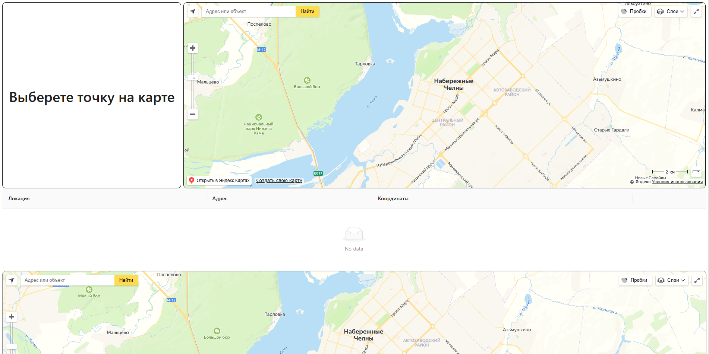
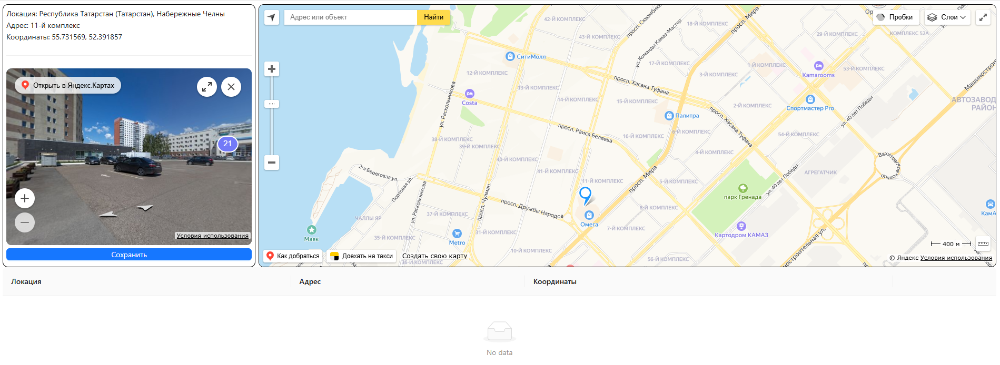
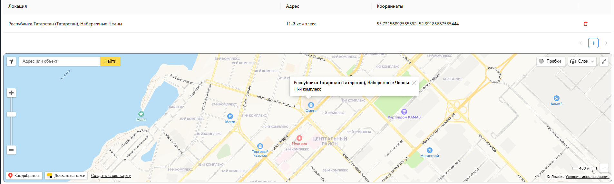
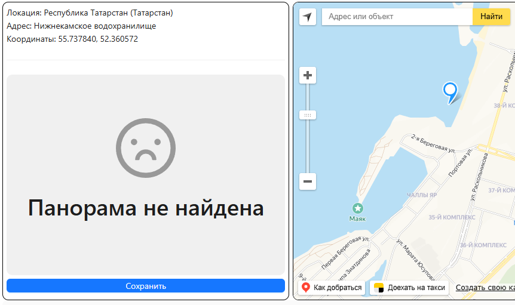

# Сайт, предоставляющий координаты, панораму и адрес метки с карты YandexMap.

- [Страница на gh-pages](https://h1znt.github.io/React-yandex-map/ "Ссылка на сайт")

### Стэк технологий, используемых в процессе работы над проектом.
> React, Vite, TypeScript, React Yandex Maps. 
> HTML, Uuid, Styled Component, Ant Design. 

### Главная страница

### Выбор точки

### Сохранение точки

### Если панорама не найдена

